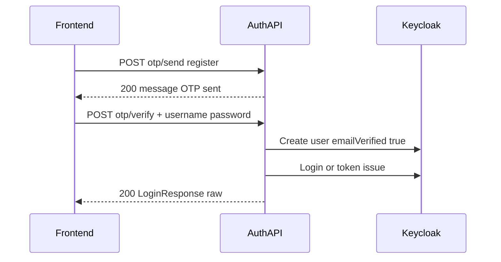
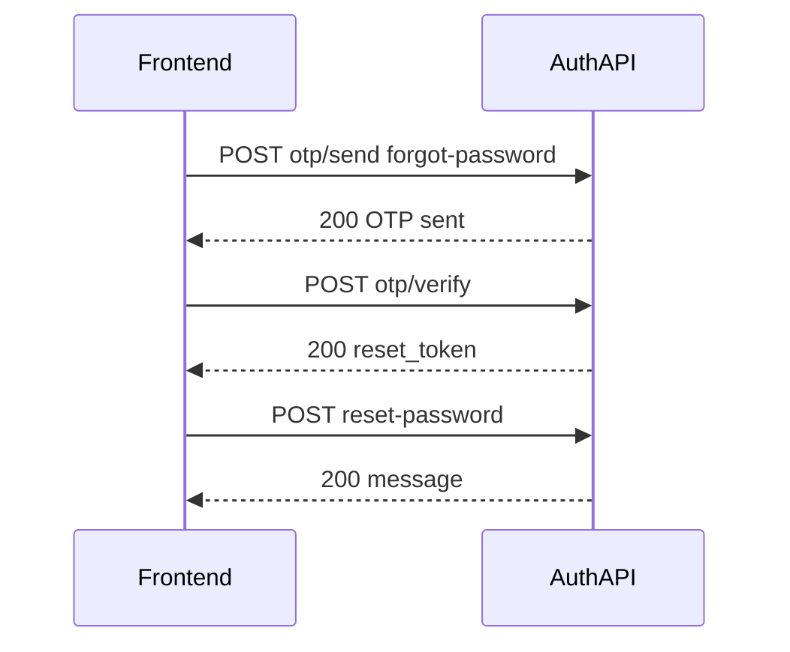

# Tích hợp Frontend — Modami Auth Service

Tài liệu mô tả toàn bộ API public/protected của service, chuẩn response, và các luồng nghiệp vụ phức tạp (đăng ký OTP, quên mật khẩu, social login, đổi email).

**Base path API:** `/v1/auth-services`  
**Ví dụ host dev (swagger):** `http://localhost:8085` — thay bằng URL môi trường thực tế.

**Swagger UI (khi server chạy):** `GET /swagger/index.html` (đường dẫn tuyệt đối trên cùng host với service).

---

## Mục lục

1. [Chuẩn response](#1-chuẩn-response)
2. [Mã lỗi `error.code`](#2-mã-lỗi-errorcode)
3. [Danh sách API](#3-danh-sách-api)
4. [Luồng nghiệp vụ chi tiết](#4-luồng-nghiệp-vụ-chi-tiết)
5. [Phụ lục](#5-phụ-lục)

---

## 1. Chuẩn response

Frontend cần phân biệt **bốn kiểu** trả về.

### 1.1. Họ A — Envelope chuẩn (`pkg-gokit/response`)

Dùng cho hầu hết handler gọi `response.OK` / `response.Created` / `response.Error` (auth envelope, admin, v.v.).

**Cấu trúc JSON:**

| Trường | Kiểu | Ý nghĩa |
|--------|------|---------|
| `success` | boolean | `true` khi thành công |
| `data` | object \| null | Payload nghiệp vụ (có thể `null` khi lỗi) |
| `error` | object \| null | Chỉ khi lỗi có cấu trúc (xem dưới) |
| `meta` | object | Thường có `request_id`, `timestamp`; có thể có `pagination` |

**`error` (khi có):**

| Trường | Kiểu | Ý nghĩa |
|--------|------|---------|
| `code` | string | Mã lỗi ứng dụng (enum, ví dụ `BAD_REQUEST`, `UNAUTHORIZED`) |
| `message` | string | Thông báo tóm tắt |
| `detail` | string | Chi tiết thêm (optional) |
| `errors` | array | Lỗi theo từng field: `{ "field": string, "message": string }` |

**HTTP status:** thường khớp ngữ nghĩa (200/201/400/401/403/404/409/502…).

### 1.2. Họ B — JSON thô (Gin), không envelope

Dùng cho các endpoint OTP / reset-password trong [`internal/delivery/http/handler/otp.go`](internal/delivery/http/handler/otp.go).

**Thành công:**

- `POST .../otp/send` — `200` + `{ "message": "OTP sent successfully" }`
- `POST .../otp/verify` với `purpose: "change-email"` — `200` + `{ "message": "Email updated successfully" }`
- `POST .../reset-password` — `200` + `{ "message": "Password reset successfully" }`

**Thành công đặc biệt (không bọc envelope):**

- `POST .../otp/verify` với `purpose: "register"` — `200` + body **trực tiếp** giống đăng nhập:  
  `access_token`, `refresh_token`, `expires_in`, `token_type`
- `POST .../otp/verify` với `purpose: "forgot-password"` — `200` + `{ "reset_token": "<string>" }`

**Lỗi (họ B):**

- `400` — `{ "error": "..." }` hoặc `{ "error": "Invalid request format" }`
- `400` validation — `{ "error": "Validation failed", "details": [ ... ] }`
- `401` — `{ "error": "unauthorized" }` (khi thiếu/không hợp lệ JWT cho luồng `change-email`)

### 1.3. Họ C — Health (không envelope)

- `GET /healthz` — `200` + `{ "status": "alive" }`
- `GET /readyz` — `200` + `{ "status": "ready" }` hoặc `503` + `{ "status": "not ready", "error": "<chi tiết>" }`

Các path này **không** nằm dưới `/v1/auth-services`.

### 1.4. `204 No Content`

Body rỗng. Dùng cho: logout, đổi mật khẩu, cập nhật profile, gán / gỡ role admin.

### 1.5. Social callback — redirect hoặc JSON

`GET /v1/auth-services/auth/social/callback`:

- Nếu backend cấu hình **Frontend callback URL** (`GetFrontendCallbackURL` không rỗng): trả **`302 Found`**, `Location` trỏ về frontend với token trong **fragment** (sau `#`), dạng:  
  `access_token=...&refresh_token=...&expires_in=...&token_type=...`  
  (giá trị đã `QueryEscape`.)
- Nếu không cấu hình: `200` + **envelope** + `data` = object token đăng nhập (`access_token`, `refresh_token`, `expires_in`, `token_type`).

**Query bắt buộc / quan trọng:** `code` (authorization code), `state` (CSRF — nên có khi dùng social login URL từ service).

---

## 2. Mã lỗi `error.code`

Các giá trị có thể xuất hiện trong envelope `error.code` (tham chiếu swagger / `apperror`):

| `code` |
|--------|
| `BAD_REQUEST` |
| `UNAUTHORIZED` |
| `FORBIDDEN` |
| `NOT_FOUND` |
| `METHOD_NOT_ALLOWED` |
| `NOT_ACCEPTABLE` |
| `REQUEST_TIMEOUT` |
| `CONFLICT` |
| `GONE` |
| `PRECONDITION_FAILED` |
| `PAYLOAD_TOO_LARGE` |
| `UNSUPPORTED_MEDIA_TYPE` |
| `VALIDATION_ERROR` |
| `UNPROCESSABLE_ENTITY` |
| `LOCKED` |
| `FAILED_DEPENDENCY` |
| `PRECONDITION_REQUIRED` |
| `TOO_MANY_REQUESTS` |
| `INTERNAL_ERROR` |
| `NOT_IMPLEMENTED` |
| `BAD_GATEWAY` |
| `SERVICE_UNAVAILABLE` |
| `TIMEOUT` |
| `CACHE_MISS` |
| `CACHE_ERROR` |
| `MESSAGE_BUS_ERROR` |

FE nên map `code` + HTTP status để hiển thị thông báo; ưu tiên `error.message` và `error.errors[]` cho form.

---

## 3. Danh sách API

Tiền tố chung cho nhóm auth công khai: **`/v1/auth-services/auth`**.

Tiền tố admin (sau khi verify JWT): **`/v1/auth-services/admin`**.

**Header admin / route cần user đã đăng nhập:**  
`Authorization: Bearer <access_token>`  
Admin cần thêm realm role `admin` trong token (middleware `RequireRealmRole("admin")`).

> **Lưu ý triển khai:** Middleware OIDC verify token hiện được gắn cho group `/v1/auth-services` dùng cho **admin**. Các route dưới `/v1/auth-services/auth/...` như `/auth/me`, đổi mật khẩu, đổi profile, và OTP `change-email` **theo thiết kế handler** vẫn đọc JWT từ context. Contract cho FE: **gửi Bearer** cho các API được đánh dấu “Bearer” dưới đây. Nếu môi trường không verify được token trên các path này, cần đồng bộ với BE (gateway hoặc bổ sung middleware) — không thuộc phạm vi file tích hợp này.

### 3.1. Health (không base `/v1/auth-services`)

| Method | Path | Auth | Request | Response |
|--------|------|------|---------|----------|
| GET | `/healthz` | Không | — | `200` `{ "status": "alive" }` |
| GET | `/readyz` | Không | — | `200` `{ "status": "ready" }` hoặc `503` `{ "status", "error" }` |

### 3.2. Auth — công khai hoặc theo token

| Method | Path đầy đủ | Auth | Content-Type | Body / Query | Status | Response |
|--------|-------------|------|--------------|--------------|--------|----------|
| POST | `/v1/auth-services/auth/login` | Không | `application/json` | **Bắt buộc:** `username`, `password` | 200 | Envelope + `data`: `access_token`, `refresh_token`, `expires_in`, `token_type` |
| POST | `/v1/auth-services/auth/register` | Không | `application/json` | **Bắt buộc:** `username`, `email`, `password` (min 8). **Tuỳ chọn:** `first_name`, `last_name` | 201 | Envelope + `data`: `user_id` |
| POST | `/v1/auth-services/auth/logout` | Không | `application/json` | **Bắt buộc:** `refresh_token` | 204 | Rỗng |
| POST | `/v1/auth-services/auth/refresh` | Không | `application/json` | **Bắt buộc:** `refresh_token` | 200 | Envelope + `data` token (cùng shape login) |
| POST | `/v1/auth-services/auth/forgot-password` | Không | `application/json` | **Bắt buộc:** `email` | 200 | Envelope + `data`: `{ "message": "if the email exists, a reset link has been sent" }` (luôn cùng nội dung để không lộ tồn tại email) |
| GET | `/v1/auth-services/auth/social/login` | Không | — | Query **bắt buộc:** `provider` ∈ `google` \| `facebook` \| `github` | 200 | Envelope + `data`: `{ "auth_url": "<url>" }` |
| GET | `/v1/auth-services/auth/social/callback` | Không | — | Query **bắt buộc:** `code`. **Nên có:** `state` | 302 hoặc 200 | Xem [§1.5](#15-social-callback--redirect-hoặc-json) |
| GET | `/v1/auth-services/auth/auth/me` | Bearer | — | — | 200 | Envelope + `data`: JWT claims (Keycloak), các trường tiêu biểu: `sub`, `email`, `email_verified`, `preferred_username`, `name`, `given_name`, `family_name`, `realm_access`, `resource_access` |
| PUT | `/v1/auth-services/auth/auth/password` | Bearer | `application/json` | **Bắt buộc:** `old_password`, `new_password` (min 8) | 204 | Rỗng |
| PUT | `/v1/auth-services/auth/auth/profile` | Bearer | `application/json` | **Tuỳ chọn (gửi field nào cập nhật field đó):** `first_name`, `last_name`, `email` (nếu có thì phải đúng format email) | 204 | Rỗng |

### 3.3. OTP & reset mật khẩu (chỉ khi service bật OTP — Redis + email)

Path base giống mục 3.2. Response thuộc **họ B** ([§1.2](#12-họ-b--json-thô-gin-không-envelope)).

| Method | Path đầy đủ | Auth | Body JSON | Status | Response thành công |
|--------|-------------|------|-----------|--------|---------------------|
| POST | `/v1/auth-services/auth/otp/send` | Bearer **chỉ khi** `purpose` = `change-email`; các purpose khác không cần | **Bắt buộc:** `email`, `purpose` ∈ `register` \| `forgot-password` \| `change-email` | 200 | `{ "message": "OTP sent successfully" }` |
| POST | `/v1/auth-services/auth/otp/verify` | Bearer **chỉ khi** `purpose` = `change-email` | **Bắt buộc:** `email`, `otp` (đúng 6 ký tự), `purpose`. Với `register` **bắt buộc thêm:** `username`, `password` (≥8). **Tuỳ chọn (register):** `first_name`, `last_name` | 200 | Phụ thuộc `purpose` — xem [§4](#4-luồng-nghiệp-vụ-chi-tiết) |
| POST | `/v1/auth-services/auth/reset-password` | Không | **Bắt buộc:** `reset_token`, `new_password` (min 8) | 200 | `{ "message": "Password reset successfully" }` |

**Điều kiện nghiệp vụ `otp/send` (server kiểm tra):**

- `register`: email **chưa** được đăng ký.
- `forgot-password`: email **phải** tồn tại.
- `change-email`: email mới **chưa** được user khác dùng; cần user đã đăng nhập (Bearer).

### 3.4. Admin

Tất cả cần **Bearer** + realm role **`admin`**.

| Method | Path đầy đủ | Request | Status | Response |
|--------|-------------|---------|--------|----------|
| GET | `/v1/auth-services/admin/users` | — | 200 | Envelope + `data`: danh sách user Keycloak (mặc định offset 0, limit 50 trong code) |
| GET | `/v1/auth-services/admin/users/:id` | Path `id` = user ID | 200 | Envelope + `data`: một user |
| GET | `/v1/auth-services/admin/users/:id/roles` | — | 200 | Envelope + `data`: danh sách realm role của user |
| POST | `/v1/auth-services/admin/users/:id/roles` | **Bắt buộc:** `{ "roles": [ ... ] }` — mỗi phần tử là object role Keycloak (tối thiểu thường cần `name`; có thể kèm `id`, … theo Keycloak) | 204 | Rỗng |
| DELETE | `/v1/auth-services/admin/users/:id/roles` | Giống POST (body `roles` cần xoá) | 204 | Rỗng |
| GET | `/v1/auth-services/admin/roles` | — | 200 | Envelope + `data`: danh sách realm roles |

---

## 4. Luồng nghiệp vụ chi tiết

### 4.1. Đăng ký — hai hướng (product chọn một hoặc dùng song song)

**Cách 1 — Đăng ký trực tiếp (không OTP)**

1. `POST /v1/auth-services/auth/register` với `username`, `email`, `password`, optional tên.
2. Nhận `201` + `user_id`. User được tạo trên Keycloak; **không** gắn bước OTP trong API này.

**Cách 2 — Đăng ký có xác minh email (OTP)**

1. `POST .../otp/send` — `{ "email": "...", "purpose": "register" }`  
   - Lỗi thường gặp: `email already registered`.
2. User nhập OTP từ email.
3. `POST .../otp/verify` — `email`, `otp`, `purpose: "register"`, **bắt buộc** `username`, `password` (≥8), optional `first_name`, `last_name`.  
   - Thành công: `200` + **token đăng nhập trực tiếp** (không envelope): `access_token`, `refresh_token`, `expires_in`, `token_type`. User được tạo với `emailVerified=true`.  
   - Lỗi có thể: OTP sai/hết hạn, `username is required`, password ngắn hơn 8 ký tự, `registration already in progress`, user đã tồn tại / conflict từ Keycloak.

### 4.2. Quên mật khẩu — hai hướng

**Cách 1 — Email đặt lại mật khẩu qua Keycloak**

1. `POST /v1/auth-services/auth/forgot-password` — `{ "email" }`.
2. Luôn nhận cùng message thành công (envelope + `data.message`) dù email có tồn tại hay không.
3. User làm theo link / flow do Keycloak gửi (UPDATE_PASSWORD).

**Cách 2 — OTP + reset token trong app**

1. `POST .../otp/send` — `{ "email", "purpose": "forgot-password" }`  
   - Lỗi: `email not found` nếu không có user.
2. `POST .../otp/verify` — `email`, `otp`, `purpose: "forgot-password"`  
   - Thành công: `{ "reset_token": "..." }` (JSON thô).
3. `POST .../reset-password` — `reset_token`, `new_password`  
   - Thành công: `{ "message": "Password reset successfully" }`.  
   - Lỗi: token hết hạn / không hợp lệ.

### 4.3. Social login (OAuth / IdP hint)

1. `GET .../social/login?provider=google|facebook|github` → lấy `auth_url`.
2. Chuyển user tới `auth_url` (browser).
3. Keycloak redirect về `.../social/callback?code=...&state=...`.
4. Backend đổi `code` lấy token; nếu có **frontend callback URL** thì **302** về FE với token ở **hash** fragment; không thì `200` envelope + `data` token.

### 4.4. Đổi email bằng OTP (`change-email`)

1. User đã đăng nhập: gửi **Bearer** trên mọi bước.
2. `POST .../otp/send` — `email` = email **mới**, `purpose: "change-email"`.  
   - Server kiểm tra email mới chưa bị chiếm.
3. `POST .../otp/verify` — cùng `email`, `otp`, `purpose: "change-email"`.  
   - Thành công: `{ "message": "Email updated successfully" }`.
4. Cập nhật email trên Keycloak theo `sub` của token.

---

## 5. Phụ lục

- **OpenAPI / Swagger:** file nguồn [`docs/swagger.yaml`](docs/swagger.yaml); một số route (ví dụ `/auth/me`, `PUT .../profile`) có thể chưa được phản ánh đầy đủ trong swagger — ưu tiên đối chiếu bảng API trong tài liệu này với [`internal/delivery/http/router.go`](internal/delivery/http/router.go).
- **OTP:** Nếu ứng dụng không khởi tạo Redis + email/OTP use case, các route `/otp/*` và `/reset-password` **không** được đăng ký.
- **Đường dẫn `/auth/auth/me`:** Do group route là `/v1/auth-services/auth` và handler đăng ký `/auth/me`, path đầy đủ là `/v1/auth-services/auth/auth/me` (đúng như bảng trên).

---

*Tài liệu được sinh để FE tích hợp; cập nhật khi router hoặc handler thay đổi.*
