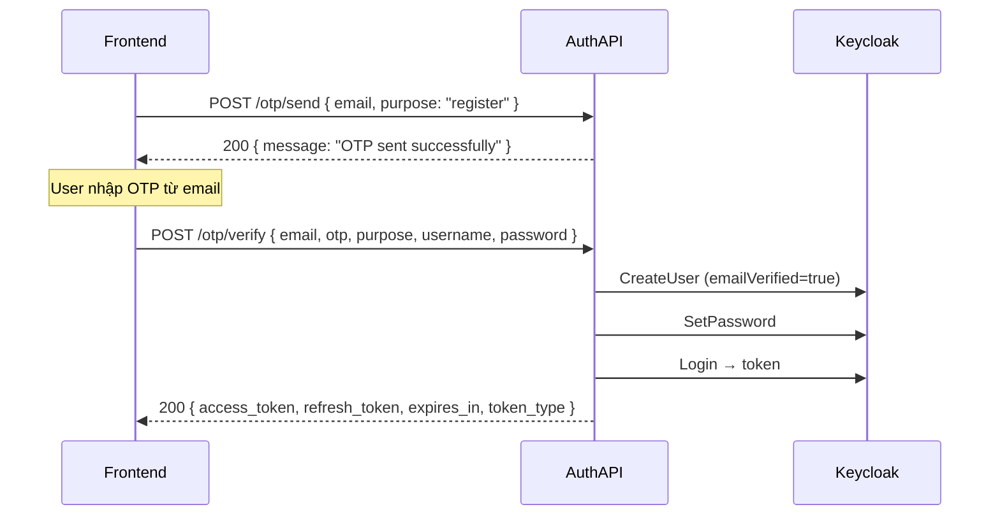
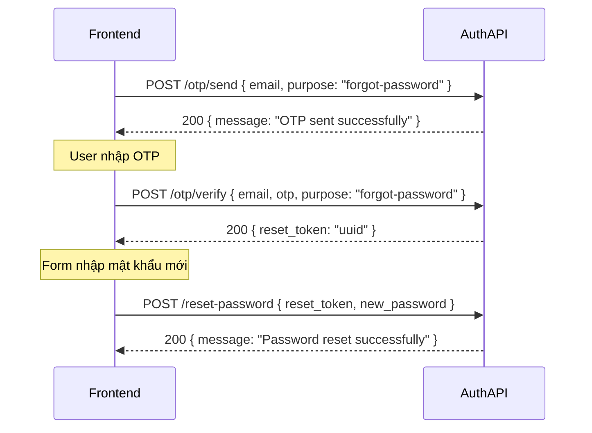
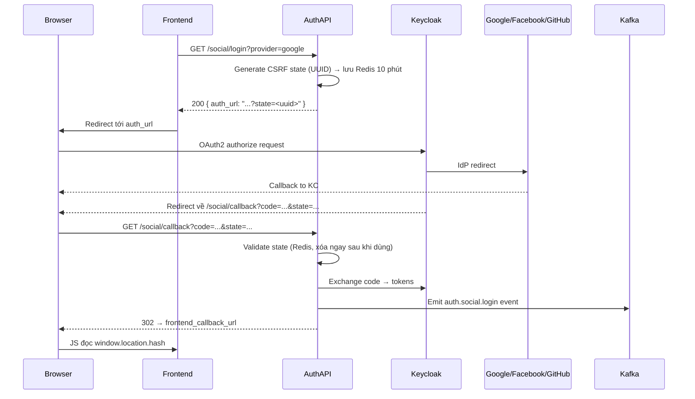
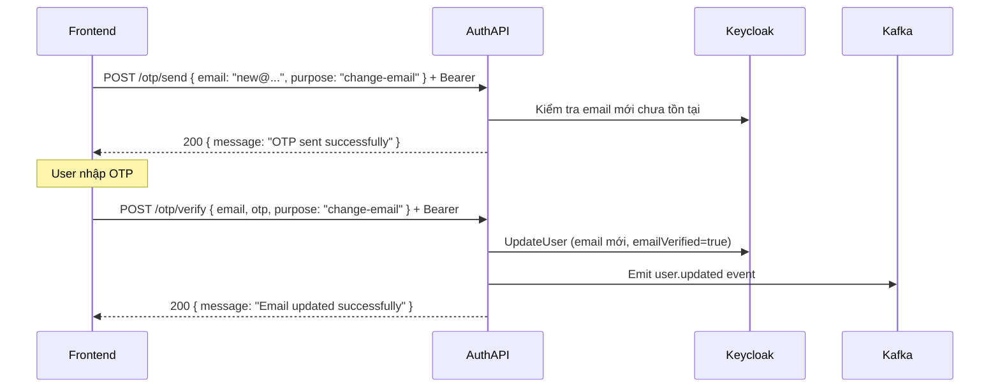

# Tích hợp Frontend — Modami Auth Service

Tài liệu mô tả toàn bộ API public/protected của service, chuẩn response, và các luồng nghiệp vụ phức tạp (đăng ký OTP, quên mật khẩu, social login, đổi email).

**Base path API:** `/v1/auth-services`
**Host dev (swagger):** `http://localhost:8085`
**Swagger UI:** `GET /swagger/index.html`

---

## Changelog

| Phiên bản | Ngày | Last uploaded | Thay đổi |
|-----------|------|---------------|----------|
| **v1.2.0** | 2026-03-29 | 2026-03-29 | Fix bug Kafka xóa topic của service khác khi startup; Auto-run DB migration khi startup (embed SQL vào binary); Thêm CSRF state vào social login URL & callback; Fix Dockerfile (cmd/server, config/); Fix `.dockerignore` không exclude `docs/docs.go`; Cập nhật GitLab CI/CD pipeline (Go 1.25, Trivy từ GHCR) |
| **v1.1.0** | 2026-03-28 | 2026-03-28 | Social login qua Keycloak IdP (Google / Facebook / GitHub): thêm `SocialLoginURL` (CSRF state lưu Redis), `ExchangeCode` (validate state one-time, emit Kafka `auth.social.login`), frontend redirect 302 với token trong fragment; thêm `FrontendCallbackURL` config; thêm `CacheService` interface vào `AuthKeycloakUseCase`; sửa `connection.go` wiring |
| **v1.0.0** | 2026-03-27 | 2026-03-27 | Khởi tạo: Auth (login, register, logout, refresh, forgot-password), OTP 2 endpoint thống nhất (`purpose`-based), Reset password, Change email, Admin CRUD user/roles, OIDC middleware, Kafka events (user.created, user.updated), Redis OTP/state |

---

## Mục lục

1. [Chuẩn response](#1-chuẩn-response)
2. [Mã lỗi `error.code`](#2-mã-lỗi-errorcode)
3. [Danh sách API](#3-danh-sách-api)
4. [Luồng nghiệp vụ chi tiết](#4-luồng-nghiệp-vụ-chi-tiết)
5. [Phụ lục](#5-phụ-lục)

---

## 1. Chuẩn response

Frontend cần phân biệt **bốn kiểu** trả về.

### 1.1. Họ A — Envelope chuẩn (`pkg-gokit/response`)

Dùng cho hầu hết handler: auth (login, register, forgot-password, social/login), admin, user (me, list, getById), role.

**Cấu trúc JSON:**

```json
{
  "success": true,
  "data": { ... },
  "error": null,
  "meta": {
    "request_id": "uuid",
    "timestamp": "2026-03-29T10:00:00Z"
  }
}
```

| Trường | Kiểu | Ý nghĩa |
|--------|------|---------|
| `success` | boolean | `true` khi thành công |
| `data` | object \| null | Payload nghiệp vụ (`null` khi lỗi) |
| `error` | object \| null | Chỉ xuất hiện khi lỗi |
| `meta` | object | Luôn có `request_id`, `timestamp` |

**`error` object:**

```json
{
  "code": "BAD_REQUEST",
  "message": "invalid request body",
  "detail": "...",
  "errors": [
    { "field": "email", "message": "email is required" }
  ]
}
```

| Trường | Kiểu | Ý nghĩa |
|--------|------|---------|
| `code` | string | Mã lỗi ứng dụng (xem [§2](#2-mã-lỗi-errorcode)) |
| `message` | string | Thông báo ngắn |
| `detail` | string | Chi tiết thêm (optional) |
| `errors` | array | Lỗi từng field: `{ "field", "message" }` |

### 1.2. Họ B — JSON thô (không envelope)

Dùng cho OTP handler (`/otp/send`, `/otp/verify`, `/reset-password`).

**Thành công:**

| Endpoint | Response body |
|----------|---------------|
| `POST .../otp/send` | `{ "message": "OTP sent successfully" }` |
| `POST .../otp/verify` — `purpose: "register"` | `{ "access_token": "...", "refresh_token": "...", "expires_in": 300, "token_type": "Bearer" }` |
| `POST .../otp/verify` — `purpose: "forgot-password"` | `{ "reset_token": "..." }` |
| `POST .../otp/verify` — `purpose: "change-email"` | `{ "message": "Email updated successfully" }` |
| `POST .../reset-password` | `{ "message": "Password reset successfully" }` |

**Lỗi (họ B):**

| HTTP | Body |
|------|------|
| `400` | `{ "error": "Invalid request format" }` |
| `400` validation | `{ "error": "Validation failed", "details": ["email: must be a valid email", ...] }` |
| `400` business | `{ "error": "<message từ usecase>" }` |
| `401` | `{ "error": "unauthorized" }` (chỉ khi `change-email` thiếu Bearer) |

### 1.3. Họ C — Health (không envelope)

```json
GET /healthz  → 200  { "status": "alive" }
GET /readyz   → 200  { "status": "ready" }
              → 503  { "status": "not ready", "error": "<chi tiết>" }
```

Các path này **không** nằm dưới `/v1/auth-services`.

### 1.4. `204 No Content`

Body rỗng. Dùng cho: `POST /logout`, `PUT /auth/password`, `PUT /auth/profile`, `POST /admin/users/:id/roles`, `DELETE /admin/users/:id/roles`.

### 1.5. Social callback — redirect hoặc JSON

`GET /v1/auth-services/auth/social/callback`:

- Khi **Frontend callback URL được cấu hình**: trả `302 Found`, `Location` trỏ về frontend với token trong **URL fragment** (`#`):
  ```
  https://app.example.com/auth/callback#access_token=...&refresh_token=...&expires_in=300&token_type=Bearer
  ```
  Giá trị đã `QueryEscape`. Frontend đọc `window.location.hash`.

- Khi **không cấu hình**: `200` + envelope + `data`:
  ```json
  { "access_token": "...", "refresh_token": "...", "expires_in": 300, "token_type": "Bearer" }
  ```

---

## 2. Mã lỗi `error.code`

| `code` | HTTP status tương ứng |
|--------|-----------------------|
| `BAD_REQUEST` | 400 |
| `VALIDATION_ERROR` | 400 |
| `UNAUTHORIZED` | 401 |
| `FORBIDDEN` | 403 |
| `NOT_FOUND` | 404 |
| `CONFLICT` | 409 |
| `UNPROCESSABLE_ENTITY` | 422 |
| `TOO_MANY_REQUESTS` | 429 |
| `INTERNAL_ERROR` | 500 |
| `BAD_GATEWAY` | 502 |
| `SERVICE_UNAVAILABLE` | 503 |
| `TIMEOUT` | 504 |
| `LOCKED` | 423 |
| `PRECONDITION_FAILED` | 412 |
| `PAYLOAD_TOO_LARGE` | 413 |
| `GONE` | 410 |
| `CACHE_MISS` | — |
| `CACHE_ERROR` | — |
| `MESSAGE_BUS_ERROR` | — |

---

## 3. Danh sách API

### 3.1. Health

| Method | Path | Auth | Response |
|--------|------|------|----------|
| GET | `/healthz` | Không | `200` `{ "status": "alive" }` |
| GET | `/readyz` | Không | `200` `{ "status": "ready" }` hoặc `503` |

---

### 3.2. Auth — public

Base prefix: `/v1/auth-services/auth`

#### POST `/v1/auth-services/auth/login`

**Request body:**
```json
{
  "username": "john",        // required
  "password": "secret123"   // required
}
```

**Response `200` — envelope + data:**
```json
{
  "access_token": "eyJ...",
  "refresh_token": "eyJ...",
  "expires_in": 300,
  "token_type": "Bearer"
}
```

**Lỗi:** `401 UNAUTHORIZED` — sai credentials.

---

#### POST `/v1/auth-services/auth/register`

**Request body:**
```json
{
  "username": "john",          // required
  "email": "john@example.com", // required, valid email
  "password": "secret123",     // required, min 8 ký tự
  "first_name": "John",        // optional
  "last_name": "Doe"           // optional
}
```

**Response `201` — envelope + data:**
```json
{
  "user_id": "uuid-từ-keycloak"
}
```

**Lỗi:** `409 CONFLICT` — username/email đã tồn tại.

---

#### POST `/v1/auth-services/auth/logout`

**Request body:**
```json
{
  "refresh_token": "eyJ..."   // required
}
```

**Response:** `204 No Content`

---

#### POST `/v1/auth-services/auth/refresh`

**Request body:**
```json
{
  "refresh_token": "eyJ..."   // required
}
```

**Response `200` — envelope + data** (cùng shape login):
```json
{
  "access_token": "eyJ...",
  "refresh_token": "eyJ...",
  "expires_in": 300,
  "token_type": "Bearer"
}
```

**Lỗi:** `401 UNAUTHORIZED` — token hết hạn / không hợp lệ.

---

#### POST `/v1/auth-services/auth/forgot-password`

**Request body:**
```json
{
  "email": "john@example.com"   // required, valid email
}
```

**Response `200` — envelope + data:**
```json
{
  "message": "if the email exists, a reset link has been sent"
}
```

> Luôn trả cùng message kể cả email không tồn tại (tránh lộ thông tin).

---

#### GET `/v1/auth-services/auth/social/login`

**Query params:**

| Param | Required | Giá trị hợp lệ |
|-------|----------|----------------|
| `provider` | ✅ | `google` \| `facebook` \| `github` |

**Response `200` — envelope + data:**
```json
{
  "auth_url": "https://keycloak.../auth?...&state=<csrf-uuid>"
}
```

> `state` là CSRF token tự sinh (UUID), được lưu Redis 10 phút. FE **không** cần tự quản lý state — browser sẽ gửi lại qua callback tự động.

**Lỗi:** `400 BAD_REQUEST` — provider không hợp lệ.

---

#### GET `/v1/auth-services/auth/social/callback`

**Query params (do Keycloak redirect về):**

| Param | Required | Mô tả |
|-------|----------|-------|
| `code` | ✅ | Authorization code từ Keycloak |
| `state` | ✅ | CSRF state (phải khớp Redis) |

**Response:** Xem [§1.5](#15-social-callback--redirect-hoặc-json).

**Lỗi:** `400` — thiếu `code`; `400` — `state` không hợp lệ/hết hạn; `401` — code exchange thất bại.

---

#### GET `/v1/auth-services/auth/auth/me`

**Auth:** Bearer token (JWT Keycloak)

**Response `200` — envelope + data** (JWT claims):
```json
{
  "sub": "uuid",
  "email": "john@example.com",
  "email_verified": true,
  "preferred_username": "john",
  "name": "John Doe",
  "given_name": "John",
  "family_name": "Doe",
  "realm_access": { "roles": ["user", "admin"] },
  "resource_access": { ... }
}
```

**Lỗi:** `401 UNAUTHORIZED` — token không hợp lệ.

---

#### PUT `/v1/auth-services/auth/auth/password`

**Auth:** Bearer token

**Request body:**
```json
{
  "old_password": "oldSecret123",   // required
  "new_password": "newSecret123"    // required, min 8 ký tự
}
```

**Response:** `204 No Content`

**Lỗi:** `401` — old password sai.

---

#### PUT `/v1/auth-services/auth/auth/profile`

**Auth:** Bearer token

**Request body** (gửi field nào thì update field đó):
```json
{
  "first_name": "John",             // optional
  "last_name": "Doe",              // optional
  "email": "new@example.com"       // optional, valid email format
}
```

**Response:** `204 No Content`

---

### 3.3. OTP & Reset Password

> Chỉ hoạt động khi service khởi động được Redis + SMTP. Nếu không, các route này **không được đăng ký**.

Base prefix: `/v1/auth-services/auth`
Response thuộc **họ B** — [§1.2](#12-họ-b--json-thô-không-envelope).

---

#### POST `/v1/auth-services/auth/otp/send`

**Auth:** Không cần, **trừ** `purpose = change-email` phải có Bearer.

**Request body:**
```json
{
  "email":   "john@example.com",   // required, valid email
  "purpose": "register"            // required: "register" | "forgot-password" | "change-email"
}
```

**Response `200`:**
```json
{ "message": "OTP sent successfully" }
```

**Điều kiện server kiểm tra trước khi gửi OTP:**

| `purpose` | Điều kiện |
|-----------|-----------|
| `register` | Email **chưa** tồn tại trong Keycloak |
| `forgot-password` | Email **phải** tồn tại |
| `change-email` | Email mới **chưa** bị user khác dùng; cần Bearer |

**Lỗi thường gặp:** `400` — `email already registered`, `email not found`, validation fail, `401` unauthorized (change-email).

---

#### POST `/v1/auth-services/auth/otp/verify`

**Auth:** Không cần, **trừ** `purpose = change-email` phải có Bearer.

**Request body:**

| Field | Required | Điều kiện |
|-------|----------|-----------|
| `email` | ✅ | valid email |
| `otp` | ✅ | đúng 6 ký tự |
| `purpose` | ✅ | `register` \| `forgot-password` \| `change-email` |
| `username` | register only | required khi `purpose = register` |
| `password` | register only | required khi `purpose = register`, min 8 ký tự |
| `first_name` | optional | chỉ dùng khi `purpose = register` |
| `last_name` | optional | chỉ dùng khi `purpose = register` |

**Ví dụ register:**
```json
{
  "email": "john@example.com",
  "otp": "123456",
  "purpose": "register",
  "username": "john",
  "password": "secret123",
  "first_name": "John",
  "last_name": "Doe"
}
```

**Response `200` tuỳ `purpose`:**

| `purpose` | Response body |
|-----------|---------------|
| `register` | `{ "access_token": "...", "refresh_token": "...", "expires_in": 300, "token_type": "Bearer" }` |
| `forgot-password` | `{ "reset_token": "<one-time-uuid>" }` |
| `change-email` | `{ "message": "Email updated successfully" }` |

**Lỗi thường gặp:** `400` — OTP sai/hết hạn, quá 5 lần thử, username required, password too short, conflict từ Keycloak; `401` — unauthorized (change-email).

---

#### POST `/v1/auth-services/auth/reset-password`

**Auth:** Không cần.

**Request body:**
```json
{
  "reset_token":  "uuid-from-otp-verify",   // required
  "new_password": "newSecret123"             // required, min 8 ký tự
}
```

**Response `200`:**
```json
{ "message": "Password reset successfully" }
```

**Lỗi:** `400` — token hết hạn (10 phút), đã dùng rồi, hoặc không tồn tại.

---

### 3.4. Admin

**Auth:** Bearer + realm role `admin` (middleware `RequireRealmRole("admin")`).
Base prefix: `/v1/auth-services/admin`

#### GET `/v1/auth-services/admin/users`

**Response `200` — envelope + data** (array):
```json
[
  {
    "id": "uuid",
    "email": "john@example.com",
    "preferred_username": "john",
    "first_name": "John",
    "last_name": "Doe",
    "enabled": true
  }
]
```

> Mặc định offset=0, limit=50.

---

#### GET `/v1/auth-services/admin/users/:id`

**Path:** `:id` = Keycloak user UUID.

**Response `200` — envelope + data:** (cùng shape một user ở trên)

---

#### GET `/v1/auth-services/admin/users/:id/roles`

**Response `200` — envelope + data** (array realm roles từ Keycloak):
```json
[
  { "id": "uuid", "name": "admin", "composite": false, "clientRole": false, "containerId": "realm" }
]
```

---

#### POST `/v1/auth-services/admin/users/:id/roles`

**Request body:**
```json
{
  "roles": [
    { "id": "role-uuid", "name": "admin" }
  ]
}
```

> `id` + `name` là tối thiểu cần thiết để Keycloak nhận diện role.

**Response:** `204 No Content`

---

#### DELETE `/v1/auth-services/admin/users/:id/roles`

**Request body:** Giống POST (danh sách role cần gỡ).

**Response:** `204 No Content`

---

#### GET `/v1/auth-services/admin/roles`

**Response `200` — envelope + data** (array tất cả realm roles):
```json
[
  { "id": "uuid", "name": "user", "composite": false }
]
```

---

## 4. Luồng nghiệp vụ chi tiết

### 4.1. Đăng ký — hai hướng

**Cách 1 — Trực tiếp (không OTP):**

```
POST /auth/register  →  201 { user_id }
```

User tạo trên Keycloak, `emailVerified = false`.

**Cách 2 — OTP (email verified):**



> User được tạo với `emailVerified=true`. Token trả về trực tiếp (họ B, không envelope).

---

### 4.2. Quên mật khẩu — hai hướng

**Cách 1 — Keycloak gửi email reset:**

```
POST /auth/forgot-password { email }  →  200 { message }  (luôn trả thành công)
```

Keycloak gửi email `UPDATE_PASSWORD` action.

**Cách 2 — OTP + reset token trong app:**



> `reset_token` có hiệu lực **10 phút**, chỉ dùng **một lần**.

---

### 4.3. Social login (OAuth2 via Keycloak IdP)



> Nếu `frontend_callback_url` chưa cấu hình, callback trả `200` + envelope thay vì redirect.

---

### 4.4. Đổi email bằng OTP

User phải đang đăng nhập. Gửi **Bearer** trên cả hai bước.



---

## 5. Phụ lục

### 5.1. Kafka events emitted

| Event | Topic | Khi nào |
|-------|-------|---------|
| `user.created` | `{env}.modami.auth.user.created` | Register (cả trực tiếp và OTP), Social login tạo user mới |
| `user.updated` | `{env}.modami.auth.user.updated` | UpdateProfile, ChangeEmail |
| `auth.social.login` | `{env}.modami.auth.social.login` | Social login callback thành công |

> `{env}` = giá trị `app.environment` trong config (mặc định `local`).

### 5.2. OTP — giới hạn & TTL

| Purpose | TTL OTP | Max thử | Reset token TTL |
|---------|---------|---------|-----------------|
| `register` | 60 giây | 5 lần | — |
| `forgot-password` | 10 phút | 5 lần | 10 phút (one-time) |
| `change-email` | 10 phút | 5 lần | — |

### 5.3. Path đặc biệt

- **`/auth/auth/me`**, **`/auth/auth/password`**, **`/auth/auth/profile`** — path có `auth` lặp đôi vì group `/v1/auth-services/auth` + route prefix `/auth/`. Đây là path thực tế đúng.
- **OTP routes không đăng ký** nếu Redis hoặc SMTP không khởi tạo được.

### 5.4. Swagger & source

- Swagger UI: `http://localhost:8085/swagger/index.html`
- OpenAPI spec: [`docs/swagger.yaml`](docs/swagger.yaml)
- Router source: [`internal/delivery/http/router.go`](internal/delivery/http/router.go)
- DTO source: [`internal/delivery/http/dto/auth_dto.go`](internal/delivery/http/dto/auth_dto.go)
- Entity source: [`internal/entity/auth.go`](internal/entity/auth.go)

---

*Cập nhật: 2026-03-29 — v1.2.0*
