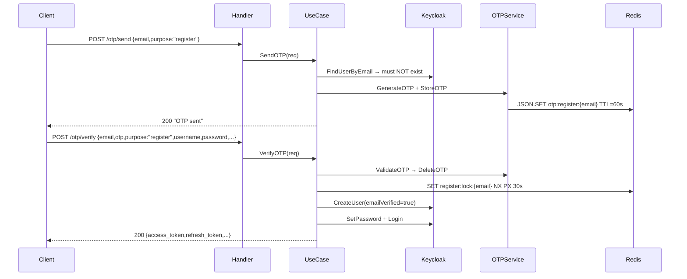
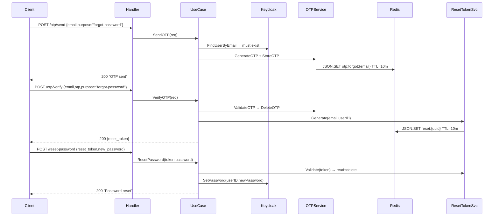
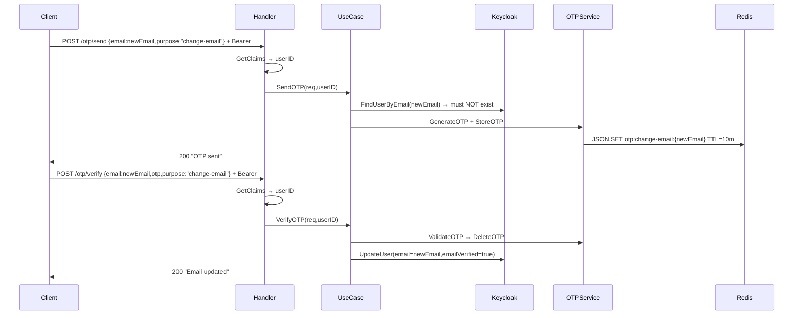

# OTP + Redis Integration

## Tổng quan

OTP 6 số, tối đa **5 lần** nhập sai trước khi khóa (xóa key).
3 luồng dùng chung **2 endpoint** (`/otp/send` + `/otp/verify`), phân biệt bằng field `purpose`.

| Purpose            | Key Redis                      | TTL     |
|--------------------|--------------------------------|---------|
| `register`         | `otp:register:{email}`         | 60s     |
| `forgot-password`  | `otp:forgot:{email}`           | 10 phút |
| `change-email`     | `otp:change-email:{newEmail}`  | 10 phút |

Email đã `trim + lowercase` trong use case.

---

## Yêu cầu hạ tầng

Redis phải có **RedisJSON** module:

| Lệnh Redis       | Wrapper (`pkg/storage/redis/cache_service.go`) |
|-------------------|-------------------------------------------------|
| `JSON.SET`        | `SetJSON(ctx, key, value, ttl)`                 |
| `JSON.GET`        | `GetJSON(ctx, key, dest)`                       |
| `JSON.NUMINCRBY`  | `JSONIncrementField(ctx, key, field, incr)`     |
| `SET … NX PX`     | `SetNX(ctx, key, value, ttl)` — idempotency lock|

> Cần **Redis Stack** hoặc Redis + RedisJSON module.

---

## Endpoints

| # | Method | Path | Auth | Mô tả |
|---|--------|------|------|-------|
| 1 | POST | `/v1/auth-services/auth/otp/send` | Public* | Gửi OTP |
| 2 | POST | `/v1/auth-services/auth/otp/verify` | Public* | Xác thực OTP |
| 3 | POST | `/v1/auth-services/auth/reset-password` | Public | Đặt lại mật khẩu bằng reset token |

> \* `purpose=change-email` yêu cầu Bearer token (handler tự kiểm tra).

---

### 1. POST `/v1/auth-services/auth/otp/send`

**Request:**

```json
{
  "email": "user@example.com",
  "purpose": "register"
}
```

`purpose`: `"register"` | `"forgot-password"` | `"change-email"`

**Pre-check theo purpose:**

| Purpose | Điều kiện |
|---------|-----------|
| `register` | Email chưa tồn tại trong Keycloak |
| `forgot-password` | Email phải tồn tại |
| `change-email` | Email mới chưa bị dùng + yêu cầu Bearer token |

**Response 200:**

```json
{ "message": "OTP sent successfully" }
```

---

### 2. POST `/v1/auth-services/auth/otp/verify`

**Request:**

```json
{
  "email": "user@example.com",
  "otp": "123456",
  "purpose": "register",
  "username": "johndoe",
  "password": "secret123",
  "first_name": "John",
  "last_name": "Doe"
}
```

| Field | Khi nào bắt buộc |
|-------|-------------------|
| `email`, `otp`, `purpose` | Luôn luôn |
| `username`, `password` | Chỉ khi `purpose=register` |
| `first_name`, `last_name` | Optional (register) |

**Response 200 — tuỳ purpose:**

Register → trả tokens:
```json
{
  "access_token": "...",
  "refresh_token": "...",
  "expires_in": 300,
  "token_type": "Bearer"
}
```

Forgot-password → trả reset token:
```json
{ "reset_token": "uuid-..." }
```

Change-email → trả success:
```json
{ "message": "Email updated successfully" }
```

---

### 3. POST `/v1/auth-services/auth/reset-password`

**Request:**

```json
{
  "reset_token": "uuid-...",
  "new_password": "newSecret456"
}
```

**Response 200:**

```json
{ "message": "Password reset successfully" }
```

---

## Luồng nghiệp vụ

### 1. Register



**Critical:** OTP verify xong mới create user. `emailVerified=true`. Idempotency lock 30s.

---

### 2. Forgot Password



**Critical:** KHÔNG issue token sau OTP. Reset token: TTL 10m, one-time.

---

### 3. Change Email



---

## Redis key summary

| Key pattern | Mô tả | TTL |
|-------------|-------|-----|
| `otp:register:{email}` | OTP đăng ký | 60s |
| `otp:forgot:{email}` | OTP quên mật khẩu | 10m |
| `otp:change-email:{email}` | OTP đổi email | 10m |
| `register:lock:{email}` | Idempotency lock đăng ký | 30s |
| `reset:{uuid}` | One-time reset token | 10m |

---

## Hướng dẫn tích hợp FE

### Register

```js
// Step 1
await axios.post(`${BASE}/v1/auth-services/auth/otp/send`, {
  email: "user@example.com",
  purpose: "register"
});

// Step 2
const { data } = await axios.post(`${BASE}/v1/auth-services/auth/otp/verify`, {
  email: "user@example.com",
  otp: "123456",
  purpose: "register",
  username: "johndoe",
  password: "secret123",
  first_name: "John",
  last_name: "Doe"
});
// data = { access_token, refresh_token, expires_in, token_type }
```

### Forgot password

```js
// Step 1
await axios.post(`${BASE}/v1/auth-services/auth/otp/send`, {
  email: "user@example.com",
  purpose: "forgot-password"
});

// Step 2
const { data } = await axios.post(`${BASE}/v1/auth-services/auth/otp/verify`, {
  email: "user@example.com",
  otp: "123456",
  purpose: "forgot-password"
});

// Step 3
await axios.post(`${BASE}/v1/auth-services/auth/reset-password`, {
  reset_token: data.reset_token,
  new_password: "newSecret456"
});
```

### Change email (requires Bearer)

```js
const headers = { Authorization: `Bearer ${accessToken}` };

// Step 1
await axios.post(`${BASE}/v1/auth-services/auth/otp/send`,
  { email: "newemail@example.com", purpose: "change-email" },
  { headers }
);

// Step 2
await axios.post(`${BASE}/v1/auth-services/auth/otp/verify`,
  { email: "newemail@example.com", otp: "123456", purpose: "change-email" },
  { headers }
);
```

---

## Bảng lỗi HTTP

| Status | Error | Mô tả |
|--------|-------|-------|
| 400 | `Invalid request format` | Body JSON không hợp lệ |
| 400 | `Validation failed` | Thiếu field / sai format |
| 400 | `email already registered` | Register: email đã tồn tại |
| 400 | `email not found` | Forgot: email không tồn tại |
| 400 | `email already in use` | Change-email: email mới đã bị dùng |
| 400 | `failed to generate OTP` | Lỗi nội bộ tạo OTP |
| 400 | `failed to store OTP` | Lỗi Redis |
| 400 | `failed to send otp email` | Lỗi SMTP |
| 400 | `otp expired` | OTP hết hạn / không tồn tại |
| 400 | `invalid otp` | Mã sai (còn lượt thử) |
| 400 | `max retry exceeded` | Vượt 5 lần → key bị xóa |
| 400 | `username is required` | Register verify thiếu username |
| 400 | `password must be at least 8 characters` | Register verify password ngắn |
| 400 | `registration already in progress` | Idempotency lock đang giữ |
| 400 | `reset token invalid or expired` | Token hết hạn / đã dùng |
| 401 | `unauthorized` | Change-email thiếu Bearer token |
